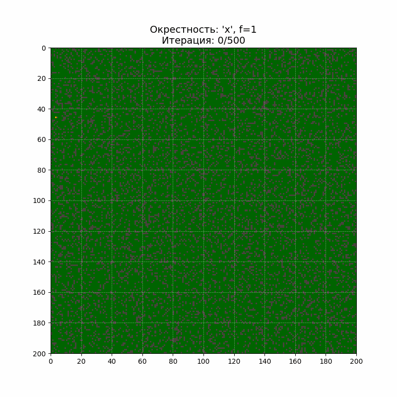
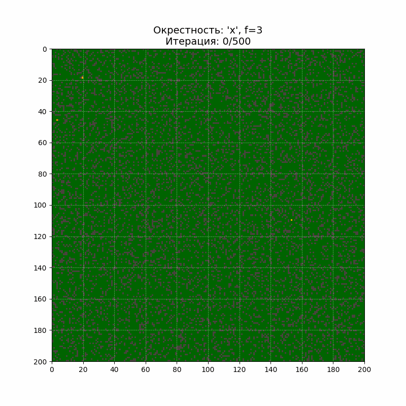
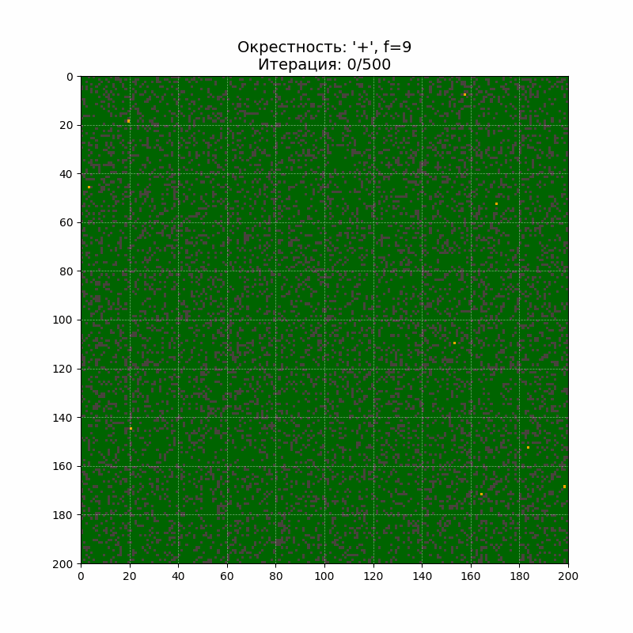
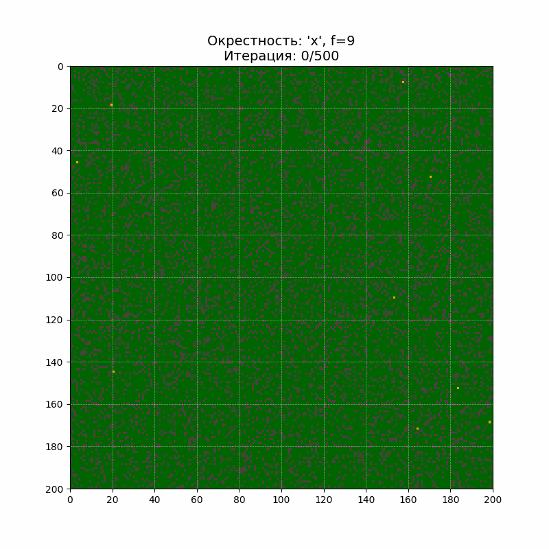

# Модель лесного пожара на клеточных автоматах

<a href="https://github.com/diam0voi/lab1v4_forest_model/blob/main/LICENSE">
  
</a>

  Этот проект представляет собой модель клеточного автомата, симулирующую распространение пожара в лесу. Она позволяет анализировать, как различные параметры и типы соседства клеток (окрестности) влияют на динамику пожара.

## 🌲 Результаты

Демонстрация работы модели при различных параметрах вероятности самовозгорания (`f`) и двух типах окрестностей: **фон Неймана** (учитываются 4 соседа) и **Мура** (учитываются 8 соседей).

| Окрестность фон Неймана | Окрестность Мура |
| :---: | :---: |
| *Параметр f1* | *Параметр f1* |
|  |  |
| *Параметр f3* | *Параметр f3* |
|  |  |
| *Параметр f9* | *Параметр f9* |
|  |  |

## 📂 Структура репозитория
```
.
├── assets/
│ └── GIFs/
│ ├── forest_fire_f1_hoodMOORE.gif
│ ├── forest_fire_f1_hoodNEUMAN.gif
│ ├── forest_fire_f3_hoodMOORE.gif
│ ├── forest_fire_f3_hoodNEUMAN.gif
│ ├── forest_fire_f9_hoodMOORE.gif
│ └── forest_fire_f9_hoodNEUMAN.gif
├── src/
│ ├── forest_analysis.ipynb
│ └── forest_model.py
├── .gitignore
├── LICENSE
└── README.md
```
